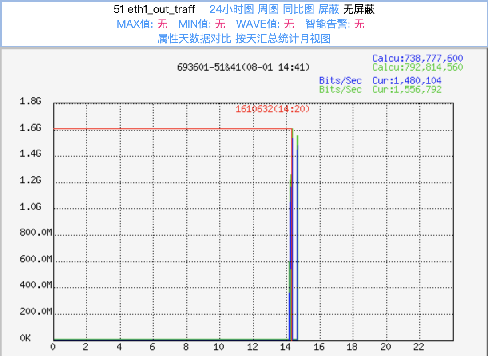
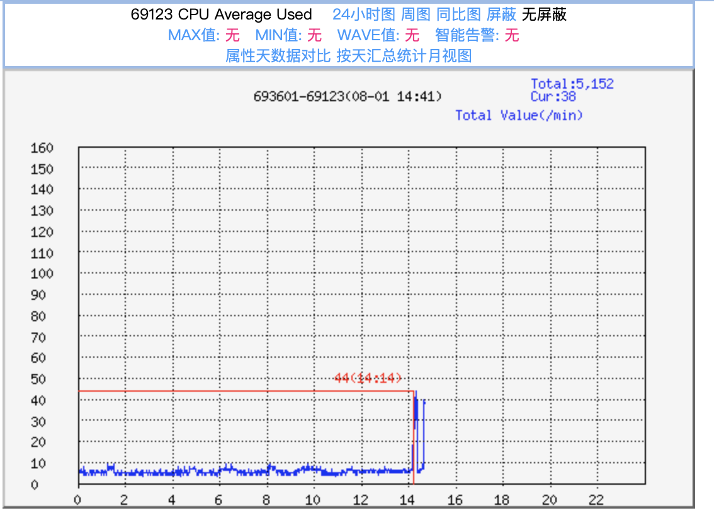
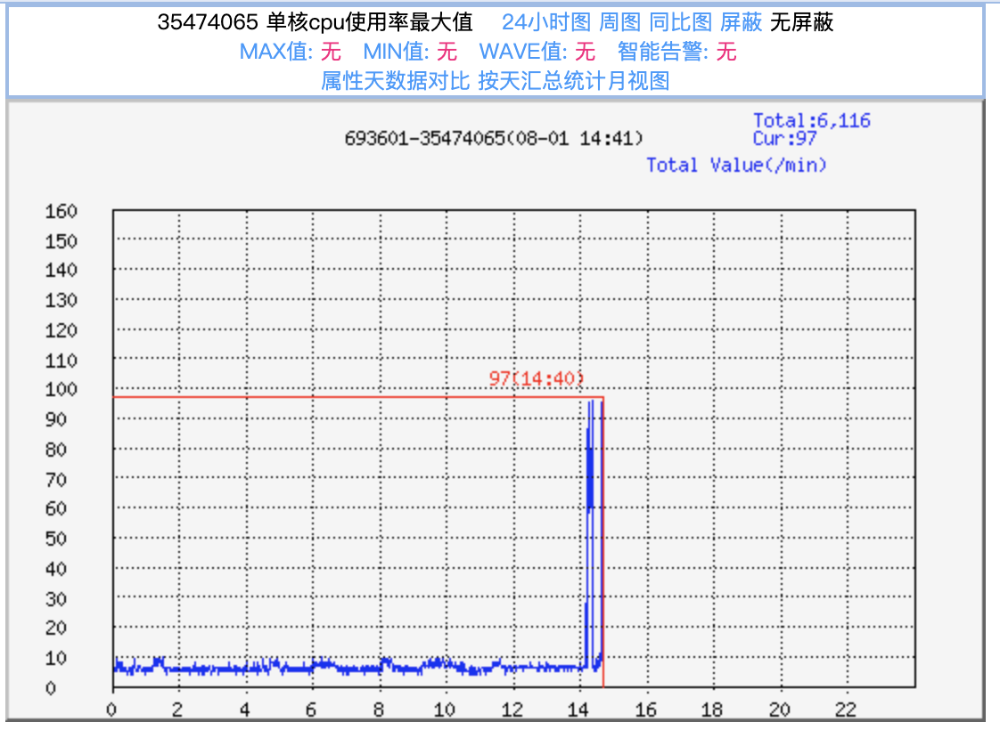

# rtc_turn_server

## Description

A TURN server for real-time communication.

Inspired by [webrtc.rs/turn](https://github.com/webrtc-rs/turn).

## Features

- [x] relay udp packets
- [ ] relay tcp packets
- [ ] support channel binding
- [ ] support multiple event loops

## Benchmark

one event loop: 1.6Gbps (1 server, 4C, 16G, S5.LARGE16)





multiple event loops: TODO

benchmark client command:
```bash
# packet size=1KB, packets per second=10M, number of parallel client threads=8
iperf -u -c <server ip> -p <server port> -l 1000 -i 5 -t 180s -b 10000000pps -P 8
```